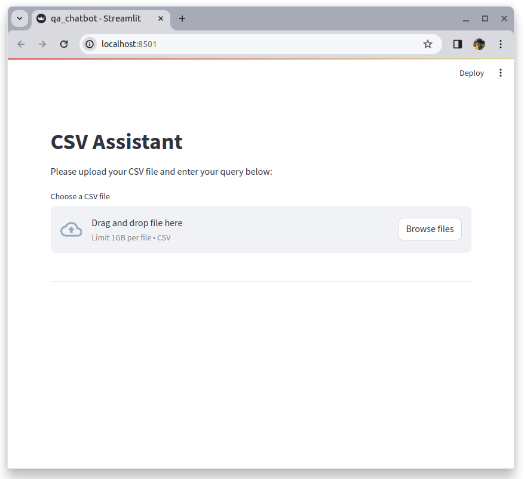
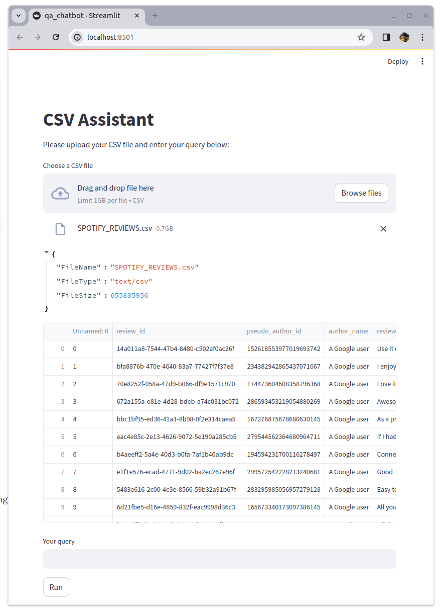
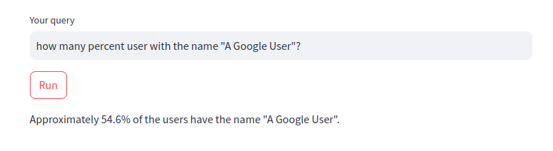

# Q&A Chatbot for CSV files
This is a simple Retrieval-Augmented Generation (RAG) to analyze the data of tabular data (`.csv` file) via chatbot. Developed and modified from original source [here](https://www.mlq.ai/csv-assistant-langchain/).


## Prerequisite

1. (Optional) Create a new python environment
```
pip install virtualenv
python<version> -m venv <virtual-environment-name>
```

2. Install required python libraries by running command :
```
pip install -r requirements.txt
```

3. Export OpenAI API key to the environment. You can get your own key on [here](https://platform.openai.com/api-keys)
```
export OPENAI_API_KEY="{your-api-key}"
```

## How to run
Start the app by running the command :
```
streamlit run qa_chatbot.py
```

If you are going to use csv file with a huge size, you can change the streamlit size limit by adding arguments:
```
streamlit run qa_chatbot.py --server.maxUploadSize 700 --server.maxMessageSize 800
```

The app will be opened automatically to your web browser, and by default will be opened in [http://localhost:8501/](http://localhost:8501/).

## How to use
1. Click `browse files` and select `.csv` file that you want to use.



2. Wait for a while to let the app load the file. After loaded it will show the preview of first few rows of the data.



3. After your data is loaded, a text field will be displayed below the table. You can type your questions related to the data. After that, press `enter` or click `Run`.

4. Wait for a while, then the app will show the results.


